O OCI Language capacita os desenvolvedores com modelos pré-treinados prontos para produção para automatizar análises de texto sofisticadas em escala sem exigir nenhum conhecimento de aprendizado de máquina. O OCI Language pode ser ser acessado por meios de APIs Rest e SDKs.

## Recursos de processamento de idioma pré-treinados:

1. Análise de sentimentos
2. Reconhecimento de entidade nomeada
3. Extração de frase chave
4. Detecção de idioma
5. Classificação de Texto

## Use a Console para analisar textos

1 - Navegue até o OCI Language
Navegue até o idioma OCI. Faça login no OCI Cloud Console. Usando o menu Burger no canto superior esquerdo, navegue até o menu Analytics e AI e clique nele e selecione o item Idioma em serviços AI.
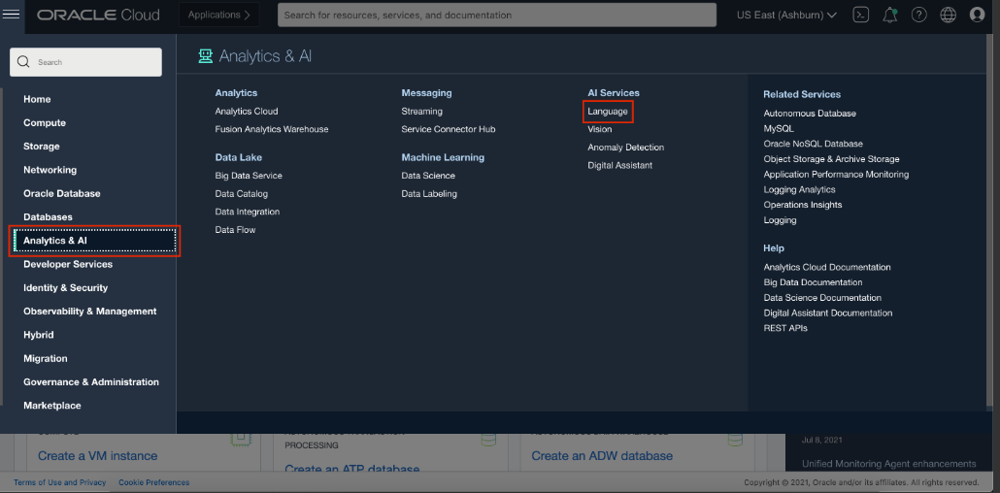

2 - Digite o texto
Digite seu texto na caixa de diálogo para analisar.

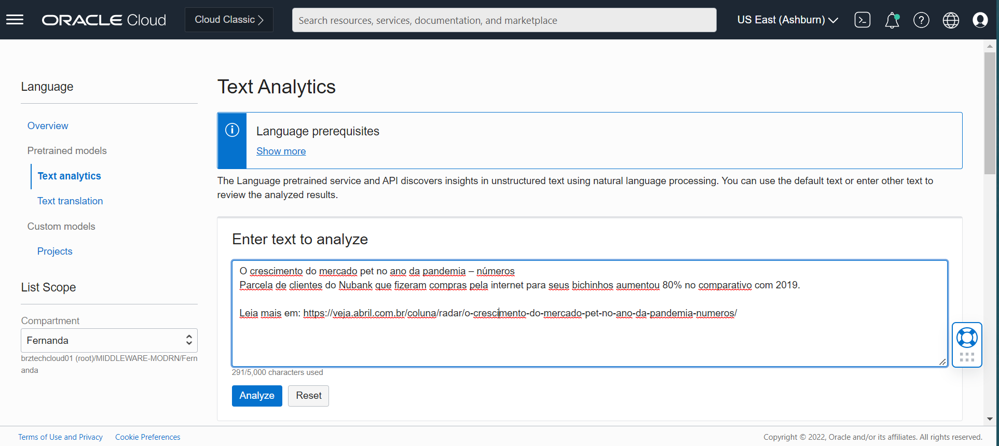

Abaixo estão alguns exemplos para o texto:

```
O crescimento do mercado pet no ano da pandemia – números
Parcela de clientes do Nubank que fizeram compras pela internet para seus bichinhos aumentou 80% no comparativo com 2019. 
Leia mais em: https://veja.abril.com.br/coluna/radar/o-crescimento-do-mercado-pet-no-ano-da-pandemia-numeros/
```

```
In 2020 people worldwide moved to working remotely because of the COVID-19 pandemic. As a result, collaborative tools like video conferencing, email and chat have become critical, as they allow employees to perform their jobs from home.
```

3 - Clique em Analisar

Você pode analisar o texto clicando no botão Analyze.


## Visualizando os resultados
Depois de analisar seu texto, o serviço do Language exibe os resultados por categoria para as ferramentas selecionadas da seguinte forma:

1 - Language Detection

Lista, por porcentagem de confiança, os idiomas detectados.

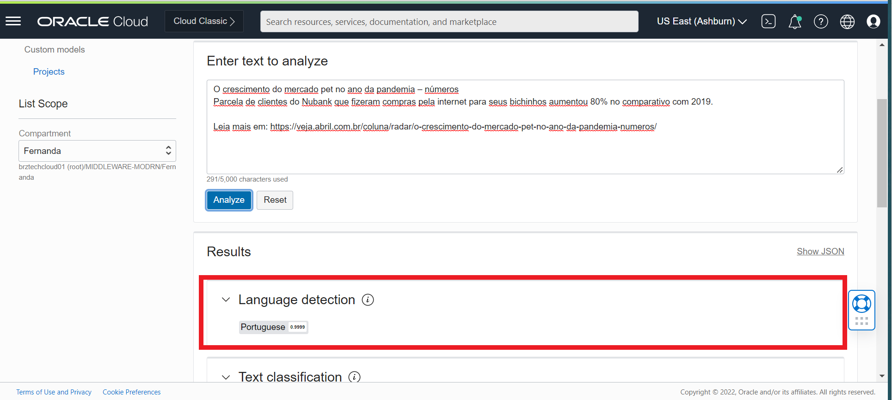

2 - Text Classification

Lista a palavra, a categoria de documento identificada e a pontuação de confiança.

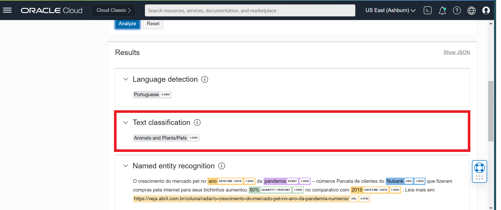

3 - Named entity recognition

Identifica as entidades nomeadas que foram encontradas e suas categorias são indicadas.

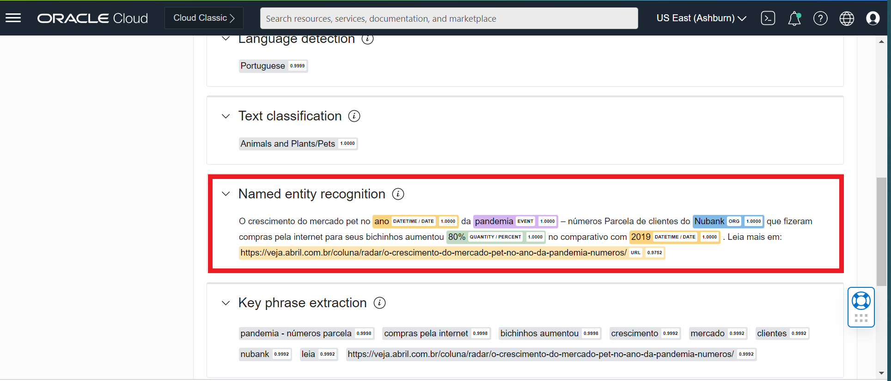

4 - Key phrase extraction

Lista as frases-chave detectadas no texto.

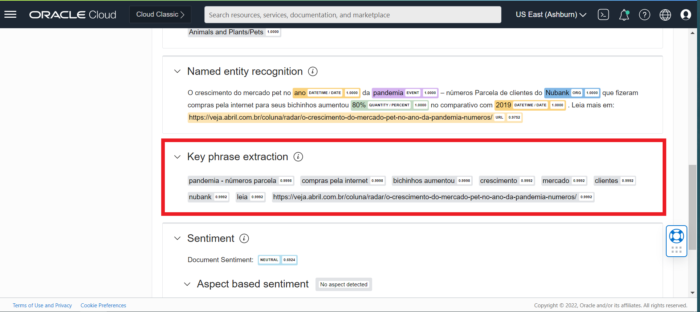

5 - Sentiment Analysis

Renderiza o nível do documento, o sentimento com base no aspecto e no nível da frase com pontuação.

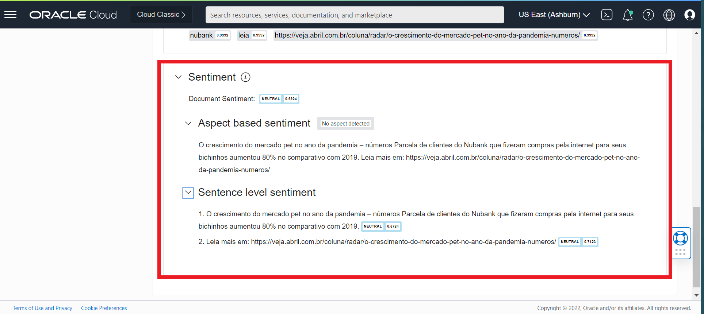

## Visualizando os resultados em JSON

Você pode clicar no botão Mostrar JSON para visualizar a saída de cada um dos recursos no formato JSON.

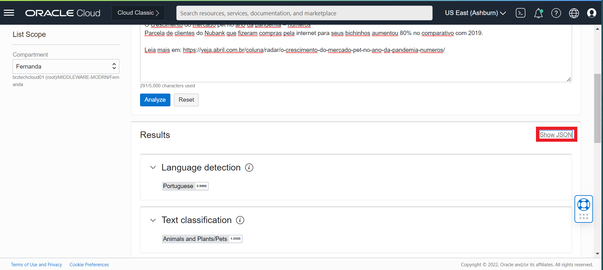

Clique no botão Mostrar resultados padrão para sair da visualização JSON.

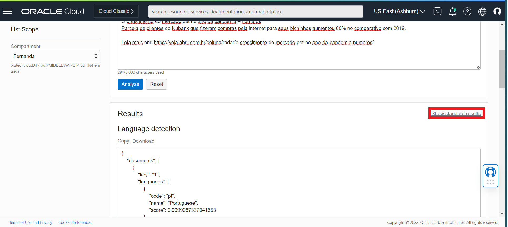

# Acesse OCI Language com SDKs 

O Oracle Cloud Infrastructure fornece vários Kits de Desenvolvimento de Software (SDKs) para facilitar o desenvolvimento de soluções personalizadas. Os SDKs permitem que você crie e implante aplicativos que se integram aos serviços do Oracle Cloud Infrastructure. Cada SDK também inclui ferramentas e artefatos necessários para desenvolver um aplicativo, como amostras de código e documentação. Além disso, se você quiser contribuir com o desenvolvimento dos SDKs, todos eles são de código aberto e estão disponíveis no GitHub.
Você pode invocar os recursos do OCI Language por meio dos SDKs OCI. Nesta sessão de laboratório, vários trechos de código serão mostrados para acessar o OCI Language por meio dos SDKs OCI. Você não precisa executar os snippets, mas revise-os para entender quais informações e etapas são necessárias para implementar sua própria integração. Além disso, você pode encontrar exemplos de linguagem OCI em diferentes linguagens de programação neste [repositório do github.](https://github.com/oracle-samples/oci-data-science-ai-samples/tree/master/ai_services/language)

1 - [SDK Para Java](https://docs.oracle.com/en-us/iaas/Content/API/SDKDocs/javasdk.htm#SDK_for_Java)

2 - [SDK Para Python](https://docs.oracle.com/en-us/iaas/Content/API/SDKDocs/pythonsdk.htm#SDK_for_Python)

3 - [SDK Para TypeScript e JavaScript](https://docs.oracle.com/en-us/iaas/Content/API/SDKDocs/typescriptsdk.htm#SDK_for_TypeScript_and_JavaScript)

4 - [SDK Para .NET](https://docs.oracle.com/en-us/iaas/Content/API/SDKDocs/dotnetsdk.htm#SDK_for_NET)

5 - [SDK Para Go](https://docs.oracle.com/en-us/iaas/Content/API/SDKDocs/gosdk.htm#SDK_for_Go)

6 - [SDK Para Ruby](https://docs.oracle.com/en-us/iaas/Content/API/SDKDocs/rubysdk.htm#SDK_for_Ruby)

## Chave de assinatura da API de configuração e arquivo de configuração

**Pré-requisito: Antes de gerar um par de chaves, crie o diretório .oci em seu diretório inicial para armazenar as credenciais.**

Mac OS / Linux:

```
mkdir ~/.oci
```

Windows:

```
mkdir %HOMEDRIVE%%HOMEPATH%\.oci
```

### Gerar um par de chaves de assinatura de API

1 - Abra as configurações do usuário

Abra o menu Perfil (ícone do menu Usuário) e clique em Configurações do usuário.

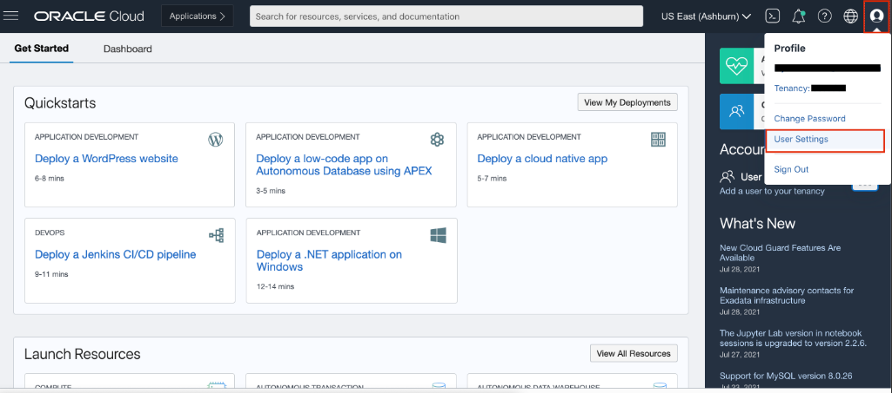

2 - Chave API 

Navegue até a chave de API e clique em Adicionar chave de API.

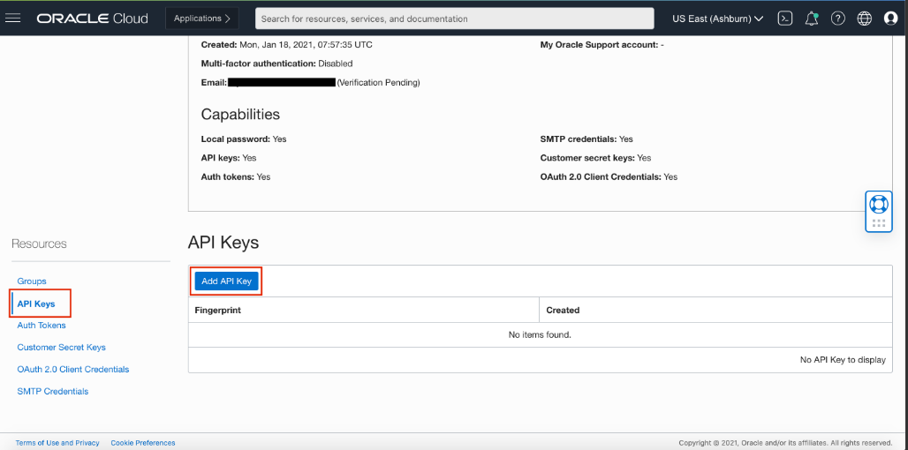

3 - Gerar chave de API

Na caixa de diálogo, selecione Gerar par de chaves de API. Clique em Baixar chave privada e salve a chave em seu diretório .oci e clique em Adicionar.

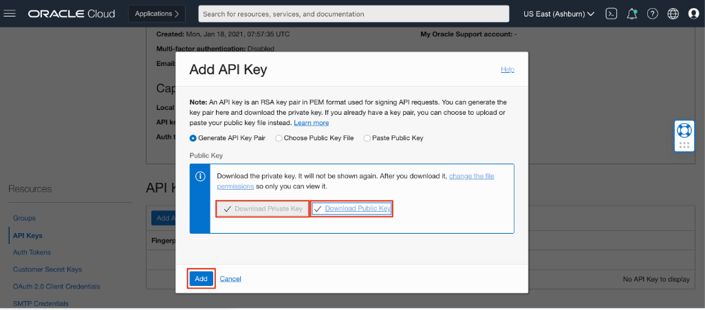

4 - Gerar arquivo de configuração

Copie os valores mostrados no console.

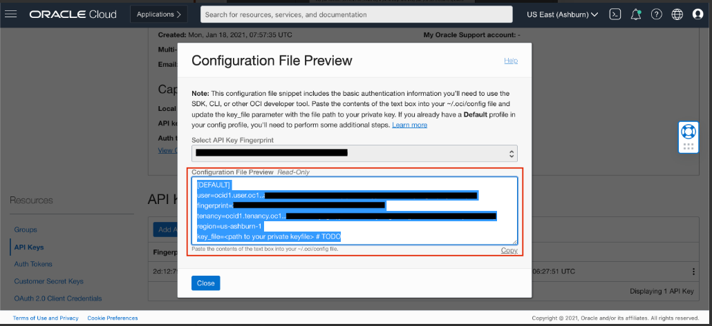

Crie um arquivo de configuração na pasta .oci e cole os valores copiados. Substitua o valor key_file pelo caminho de sua chave de API gerada.

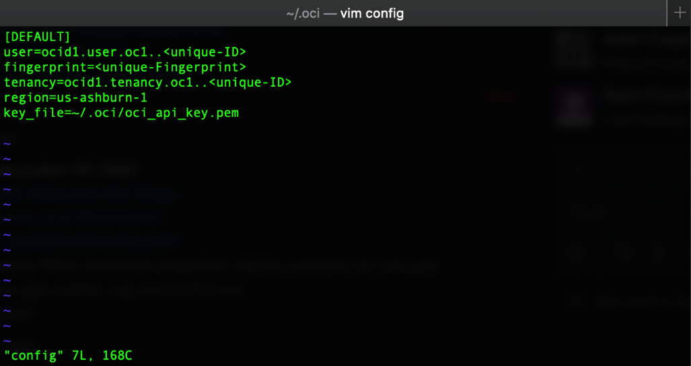

## Pré-requisitos e configuração para Python

Por favor, siga os passos na ordem descrita. Antes de prosseguir, certifique-se de ter a versão 3.x do Python e que ela esteja disponível na linha de comando. Você pode verificar isso simplesmente executando:

```
python --version
```

Se você não tiver Python, instale a versão 3.x mais recente [python.org](https://www.python.org/)

Além disso, você precisará ter certeza de que tem pip disponível. Você pode verificar isso executando:

```
pip --version
```

Se você instalou o Python a partir da fonte, com um instalador do python.org ou via Homebrew, você já deve ter o pip. Se você estiver no Linux e instalado usando o gerenciador de pacotes do sistema operacional, talvez seja necessário instalar o pip separadamente.

1 - Criar ambiente virtual

Para criar um ambiente virtual, execute o módulo venv como um script conforme mostrado abaixo

```
python3 -m venv <name of virtual environment>
```
2 - Ativar virtualenv

Depois de criar um ambiente virtual, você pode ativá-lo.

Mac OS/Linux:

```
source <name of virtual environment>/bin/activate
```

Windows:

```
<name of virtual environment>\Scripts\activate
```

3 - Instalar OCI

Agora instale oci executando:

```
pip install oci
```

## Amostra de código do SDK do serviço do OCI Language

**Python Code**

```
import oci

config = oci.config.from_file('/.oci/config')
ai_client = oci.ai_language.AIServiceLanguageClient(config=config)
#Input Text
text1 = "The Indy Autonomous Challenge is the worlds first head-to-head, high speed autonomous race taking place at the Indianapolis Motor Speedway"
text2 = "Using high-performance GPU systems in the Oracle Cloud, OCI will be the cloud engine for the artificial intelligence models that drive the MIT Driverless cars competing in the Indy Autonomous Challenge."

#language Detection of Input Documents
doc1 = oci.ai_language.models.DominantLanguageDocument(key="doc1", text=text1)
doc2 = oci.ai_language.models.DominantLanguageDocument(key="doc2", text=text2)
documents = [doc1, doc2]

batch_detect_dominant_language_details = oci.ai_language.models.BatchDetectDominantLanguageDetails(documents=documents)
output = ai_client.batch_detect_dominant_language(batch_detect_dominant_language_details)
print(output.data)


#Text Classification of Input Documents
doc1 = oci.ai_language.models.TextClassificationDocument(key="doc1", text=text1)
doc2 = oci.ai_language.models.TextClassificationDocument(key="doc2", text=text2)
documents = [doc1, doc2]

batch_detect_language_text_classification_details = oci.ai_language.models.BatchDetectLanguageTextClassificationDetails(documents=documents)
output = ai_client.batch_detect_language_text_classification(batch_detect_language_text_classification_details)
print(output.data)


#Named Entity Recoginiton of Input Documents
doc1 = oci.ai_language.models.EntityDocument(key="doc1", text=text1)
doc2 = oci.ai_language.models.EntityDocument(key="doc2", text=text2)
documents = [doc1, doc2]

batch_detect_language_entities_details = oci.ai_language.models.BatchDetectLanguageEntitiesDetails(documents=documents)
output = ai_client.batch_detect_language_entities(batch_detect_language_entities_details)
print(output.data)


#Key Phrase Detection of Input Documents
doc1 = oci.ai_language.models.KeyPhraseDocument(key="doc1", text=text1)
doc2 = oci.ai_language.models.KeyPhraseDocument(key="doc2", text=text2)
documents = [doc1, doc2]

batch_detect_language_key_phrases_details = oci.ai_language.models.BatchDetectLanguageKeyPhrasesDetails(documents=documents)
output = ai_client.batch_detect_language_key_phrases(batch_detect_language_key_phrases_details)
print(output.data)


#Aspect based and Sentence level Sentiment Analysis of Input Documents
doc1 = oci.ai_language.models.SentimentsDocument(key="doc1", text=text1)
doc2 = oci.ai_language.models.SentimentsDocument(key="doc2", text=text2)
documents = [doc1, doc2]

batch_detect_language_sentiment_details = oci.ai_language.models.BatchDetectLanguageSentimentsDetails(documents=documents)
output = ai_client.batch_detect_language_sentiments(batch_detect_language_sentiment_details,  level=["ASPECT","SENTENCE"])
print(output.data)
```

Siga as etapas abaixo para executar o SDK do Python:

1 - Baixe o código Python.

Baixe o arquivo de [código](https://oracle.github.io/learning-library/oci-library/oci-hol/oci-artificial-intelligence/ai-language/ai-language-sdk/files/language.py) e salve-o em seu diretório.

2 - Execute o Código.

Navegue até o diretório onde você salvou o arquivo acima (por padrão, ele deve estar na pasta 'Downloads') usando seu terminal e execute o arquivo executando:

```
python language.py
```

3 - Resultados

Você verá o resultado como abaixo


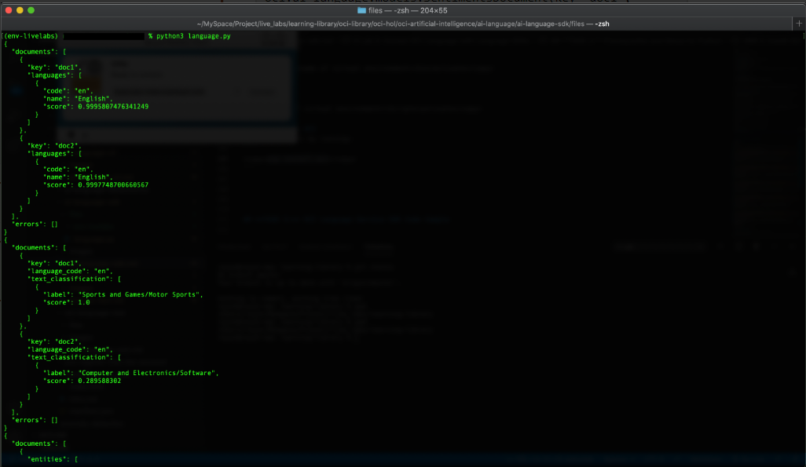

## Parabéns Por concluir este laboratório :clap:


