# OCI Speech

O OCI Speech permite que os desenvolvedores extraiam texto de áudio usando modelos ASR (Automatic Speech Recognition) pré-treinados prontos para produção. O serviço de fala da OCI fornece transcrição automatizada e precisa em escala, sem exigir nenhum conhecimento em aprendizado de máquina. Ele pode ser acessado por meio de APIs REST e SDKs.

## Crie um bucket e faça upload de arquivos de áudio

Para usar o serviço de fala OCI (Oracle Cloud Infrastructure), você deve fazer upload de arquivos de áudio formatados para um bucket de armazenamento de objetos OCI.

### Formate arquivos de áudio no formato adequado

A OCI Speech suporta arquivos de áudio PCM WAV de 16 bits de canal único com uma taxa de amostragem de 16kHz. Recomendamos Audacity (GUI) ou ffmpeg (linha de comando) para transcodificação de áudio. Se você tiver arquivos de áudio que não estão na codificação compatível, instale o ffmpeg e execute o seguinte comando: 

```
ffmpeg -y -i <path to input file> -map 0:a -ac 1 -ar 16000 -b:a 16000 -acodec pcm_s16le <caminho para saída do arquivo wav>
```

Em alguns casos raros, um arquivo WAV pode ter a codificação correta, mas ter um cabeçalho de metadados diferente. Para corrigir isso:

```
ffmpeg -i <path to input file> -c copy -fflags +bitexact -flags:v +bitexact -flags:a +bitexact <path to output wav file>
```

Se seus arquivos de áudio não estiverem no formato WAV: os usuários da GUI podem usar qualquer software de edição de áudio que possa carregar seu arquivo de entrada e salvá-lo no formato .WAV. Para cenários automatizados ou de linha de comando, recomendamos usar o utilitário ffmpeg com o seguinte comando:

```
ffmpeg -i <input.ext> -fflags +bitexact -acodec pcm_s16le -ac 1 -ar 16000 <output.wav>
```
Se precisar de ajuda para instalar o ffmepg você pode seguir [este tutorial](https://www.geeksforgeeks.org/how-to-install-ffmpeg-on-windows/)

Como alternativa, baixe o arquivo de áudio de amostra pré-formatado para utilizar neste laboratório:

[exemplo áudio](https://objectstorage.sa-saopaulo-1.oraclecloud.com/n/grhuxslsficl/b/speech/o/nutricao_pets_reporter_pet.wav)

### Carregar arquivos para o object storage

Você precisa carregar os arquivos de áudio no Object storage Oracle, para serem usados ​​nos trabalhos de transcrição nas próximas etapas.

1 - Criar um bucket do Object Storage (esta etapa é opcional caso o bucket já tenha sido criado)

Primeiro, no menu OCI Services, clique em Object Storage.

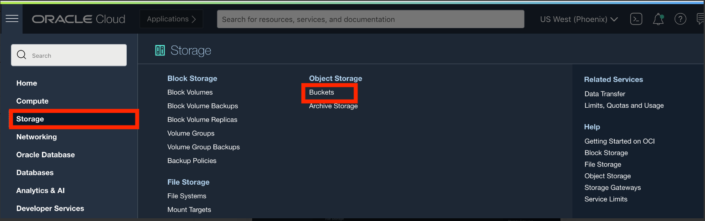

Em seguida, selecione Compartimento no menu suspenso à esquerda. Escolha o compartimento que corresponde ao seu nome ou nome da empresa.

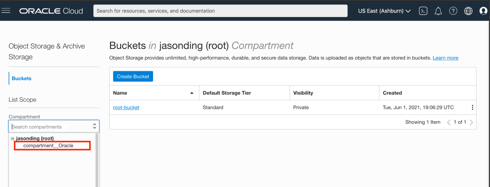

Em seguida, clique em Criar bucket.

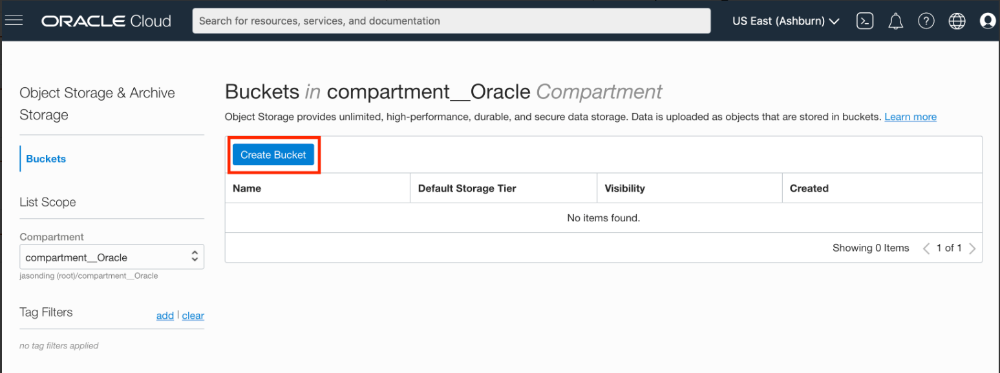

Em seguida, preencha a caixa de diálogo:

Nome do bucket: forneça um nome
Camada de armazenamento: STANDARD

Em seguida, clique em Criar

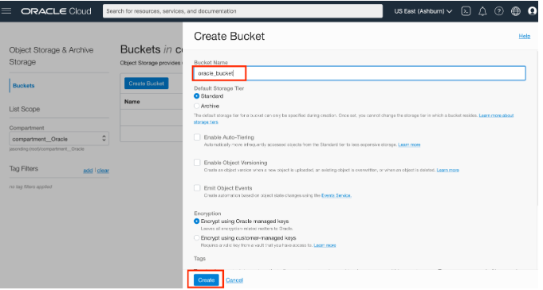

2 - Carregar arquivo de áudio no bucket de armazenamento

clique no nome do bucket.

Selecione ou arraste o arquivo e clique em carregar

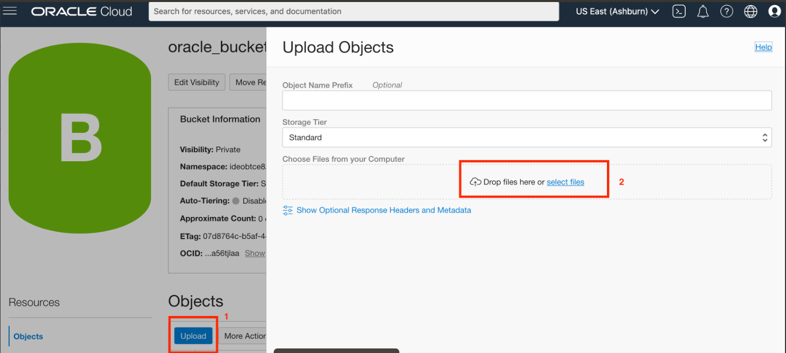

Mais detalhes sobre o armazenamento de objetos podem ser encontrados [nesta página](https://oracle.github.io/learning-library/oci-library/oci-hol/object-storage/workshops/freetier/index.html?lab=object-storage).

## Transcreva áudio com o console

Nesta sessão, você aprenderá a usar o serviço do OCI Speech por meio do console na nuvem.

Faça login no OCI Cloud Console. Usando o menu Burger no canto superior esquerdo, navegue até o menu Analytics e AI e clique nele e selecione o item Idioma em serviços AI.

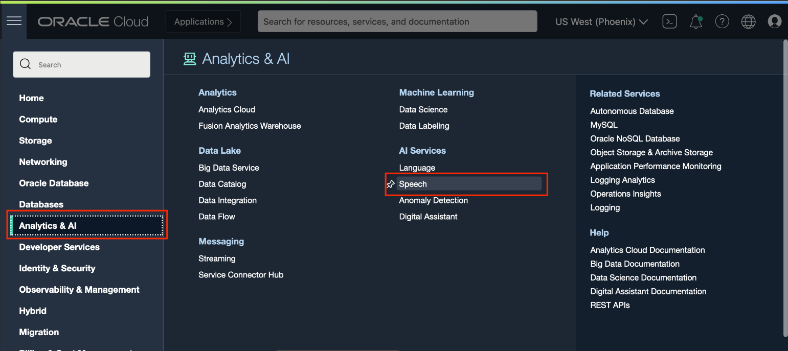

Isso o levará à página de visão geral dos trabalhos de transcrição. À esquerda, você pode alternar entre a página de listagem de trabalhos de visão geral e transcrição. Na documentação, você pode encontrar links úteis relevantes para o serviço de fala OCI

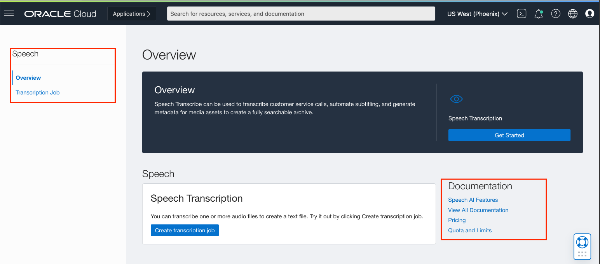

## Criar e gerenciar trabalho de transcrição

1 - Navegue até o OCI Speech

Clique em "Transcription Job" para navegar até a lista de trabalhos de transcrição.

2 - Criar trabalho de transcrição

Selecione o compartimento no qual você deseja criar seu trabalho de transcrição e clique no botão "Criar trabalho de transcrição" para iniciar o processo de criação do trabalho.

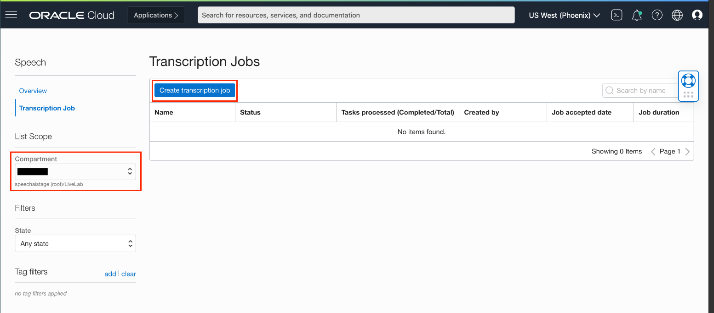

3 - Insira as informações do trabalho na página de informações básicas

Esta página está dividida em três seções
**Job Information**: Opcionalmente, insira um nome e uma descrição para seu trabalho de transcrição, bem como escolha o compartimento em que deseja que seu trabalho esteja.

**Data**: Selecione o bucket no armazenamento de objetos que contém os arquivos que você deseja transcrever e, opcionalmente, escolha onde deseja que os arquivos de saída sejam armazenados e/ou dê um prefixo aos nomes dos arquivos.

**Configure transcription**: Escolha o idioma em que o áudio que deseja transcrever está e, opcionalmente, adicione filtros clicando no botão "Adicionar filtro".

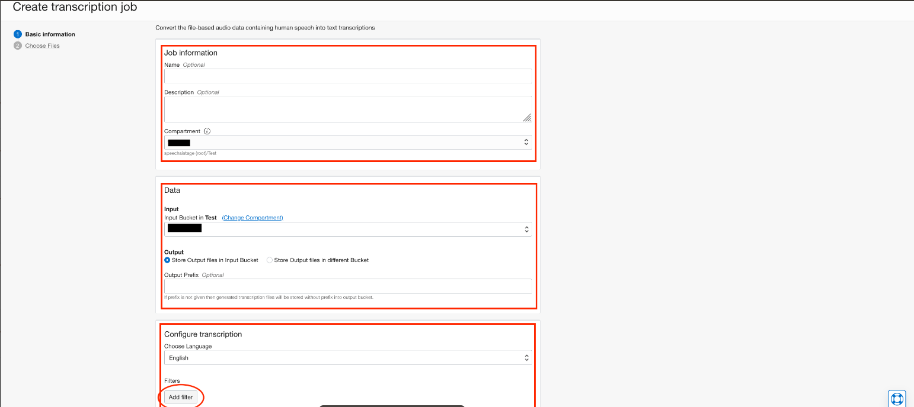

Clique em "Avançar" para continuar a seleção do arquivo

4 - Selecione quais arquivos do Object Storage serão transcritos neste trabalho Use a alternância "Mostrar arquivos wav" para filtrar o bucket de entrada apenas para arquivos .wav Selecione um ou mais arquivos para transcrever do bucket especificado no armazenamento de objetos e clique em "Enviar".

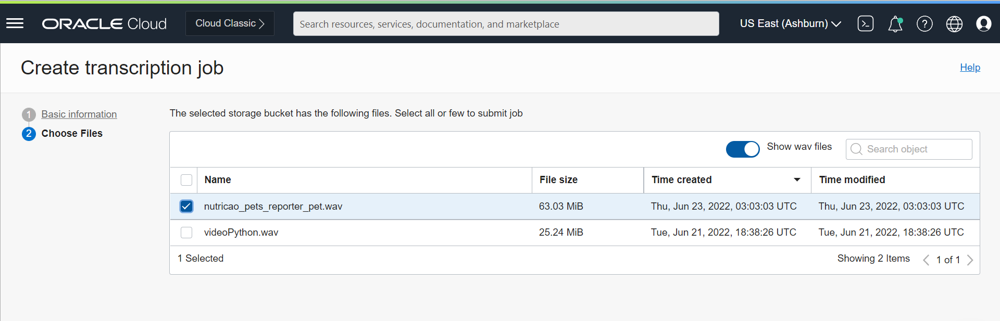

5 - Visualizar trabalho recém-criado na lista de trabalhos de transcrição

Assim que o trabalho for criado, você será direcionado de volta à página da lista de trabalhos de transcrição, onde o trabalho recém-criado estará no topo. Observe que o status do trabalho provavelmente será "Aceito" ou "Em andamento"

Outros estados de trabalho possíveis são "Bem-sucedido" "Falha" "Parcialmente bem-sucedido" e "Cancelado"

Você pode usar o filtro de estado no canto inferior esquerdo para filtrar os trabalhos na lista com base nesses estados

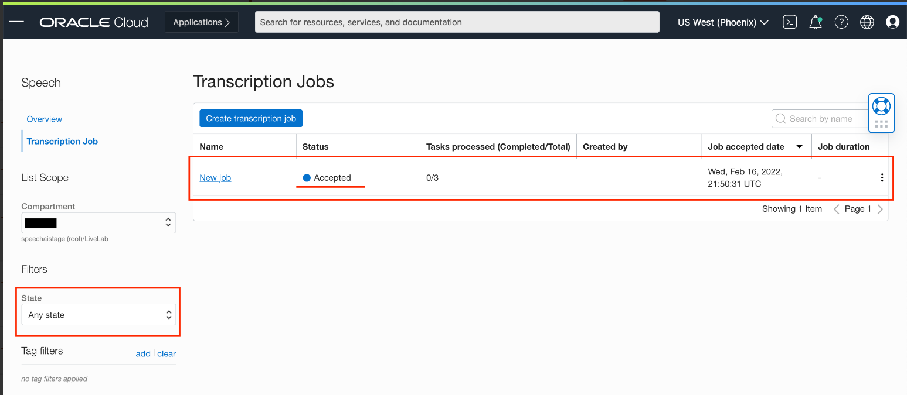

## Visualizando os resultados

Para visualizar o resultado da transcrição, navegaremos para cada página de detalhes do trabalho e da tarefa

1 - Navegando para a página de detalhes do trabalho

Na página da lista de trabalhos de transcrição, clique em "Ver detalhes" através do menu de três pontos na extremidade direita do trabalho

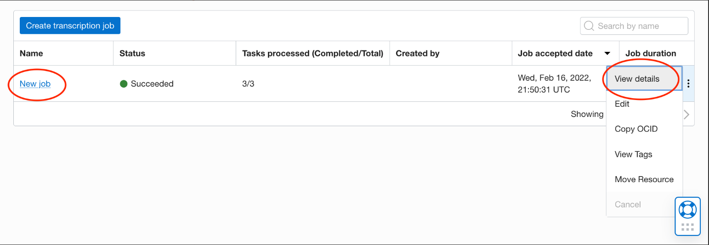

2 - Página de detalhes do trabalho

A página de detalhes do trabalho é dividida em duas seções principais, na parte superior podemos ver vários metadados relacionados ao trabalho, como descrição, compartimento em que o trabalho está localizado e idioma do áudio transcrito.

A segunda seção é a lista de tarefas de trabalho que mostra todos os arquivos (agora tarefas dubladas) que selecionamos anteriormente para transcrever.

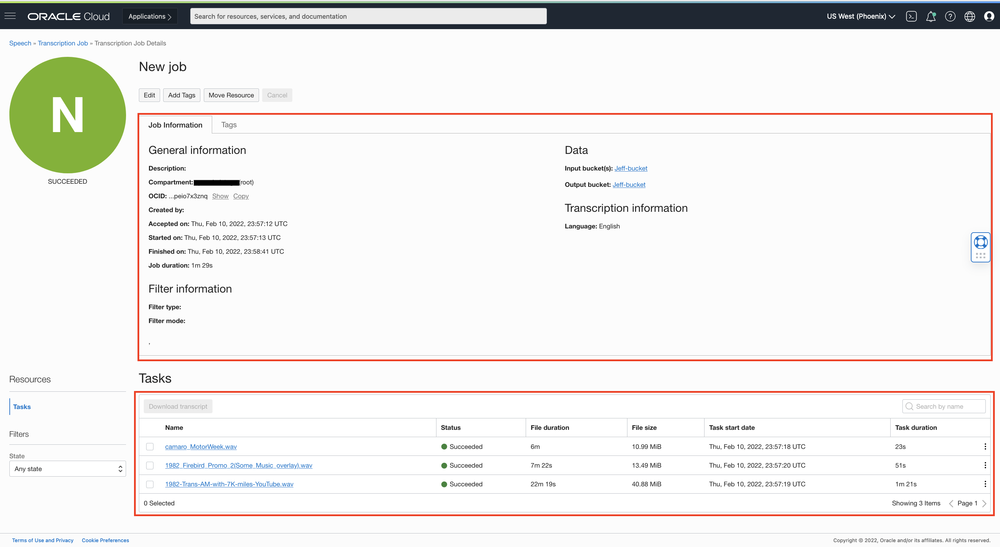

3 - Navegue até os detalhes da tarefa individual

Para visualizar os metadados e a transcrição real de cada tarefa (arquivo) neste trabalho, clique no nome da tarefa específica na lista ou clique em "Visualizar detalhes" no menu de três pontos na extremidade direita

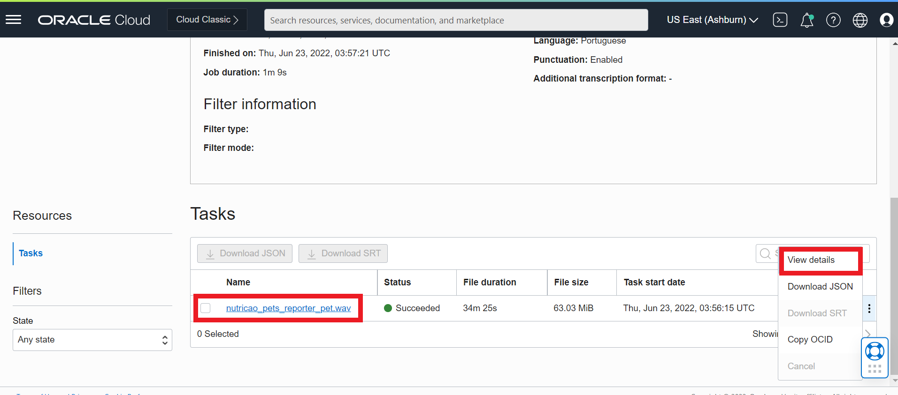

4 - Página de detalhes da tarefa

Semelhante à página de detalhes do trabalho, na página de detalhes da tarefa podemos visualizar metadados específicos para a tarefa na seção acima, bem como a própria transcrição de áudio na seção inferior

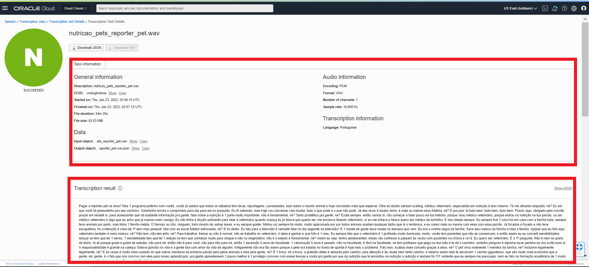

## Baixando e visualizando os resultados em JSON

Você pode clicar em "Baixar transcrição" no canto superior esquerdo para baixar a transcrição no formato JSON. Clique no botão "Mostrar botão JSON" para visualizar a transcrição no formato JSON.

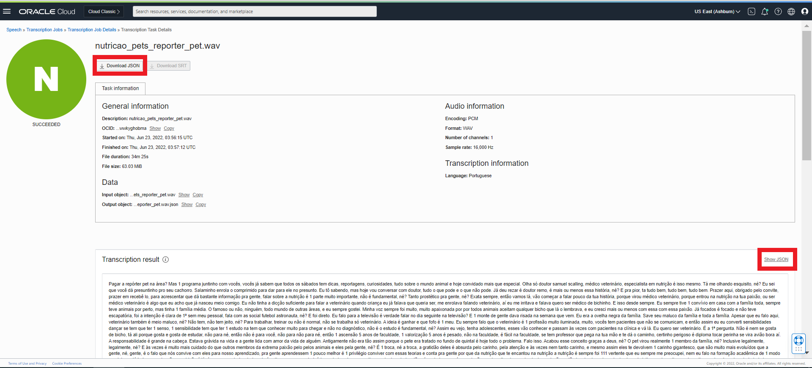

Clique no botão Mostrar resultados padrão para sair da visualização JSON.

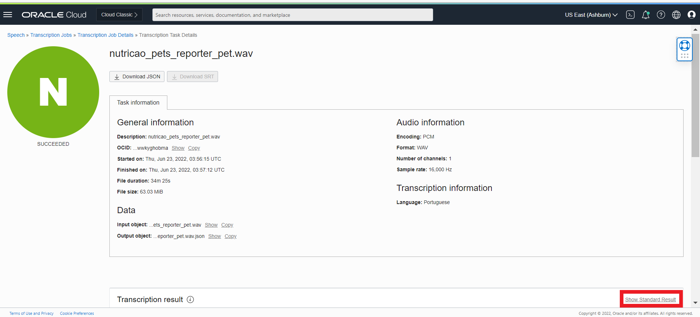

# ** Parabéns por concluir este laboratório :clap:


