# Lab Vision - Classificação de Raças de Gatos

Vamos criar um modelo de Visão Computacional Customizado, utilizando a um modelo de Deep Learning pré-treinado e o OCI Vision. 

1.	  Faça o Download do dataset. Temos 2 datasets disponíveis para este laboratório, um menor, contendo apenas imagens de 2 raças de gatos (Exótico e Sphynx) e outro maior, com imagens de 6 raças (American, TurkishAngora, Exotic, Maine Coon, ViraLata/Siamese, Sphynx). Neste tutorial, mostraremos os passos para a criação do modelo para o dataset menor, com apenas duas raças, mas os mesmos passos se aplicam para a criação do modelo maior. Tente os dois! 

2.	  Agora, faremos a criação do Object Storage no OCI. Para isso, inicialmente, vamos criar um Bucket onde armazenaremos nossas imagens. 
A sequência:
Menu de Hamburger -> Storage -> Object Storage -> Buckets

Menu de Hamburger

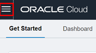

Storage

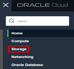

Buckets

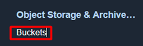        

                                   
3.	  Caso esteja usando um ambiente novo (como provavelmente será), não haverá nenhum Bucket, então vamos criar um! Basta clicar no botão “Create bucket”. Definimos então os parâmetros desse bucket, como nome e o tier. Podemos manter o tier no padrão (Standard, já selecionado) e escolhemos o nome. Dê um nome bem descritivo que te permita lembrar dele, pois utilizaremos esse bucket nos passos seguintes. Como temos 2 datasets a disposição, é interessante criar dois buckets, um para cada um deles. Um bom exemplo de nome seria: “MuShop_Dataset_2raças”.   

4.	Upload dos arquivos para o bucket. Podemos fazer este passo de duas formas, tanto arrastando os arquivos para o bucket quanto via linha de comando.
<br/>

  *   **Arrastando para o bucket:** Ao abrir o bucket, vamos notar um botão de “Upload” (1) dentro de um retângulo azul. Clicando neste botão, irá abrir um menu sobre como vamos fazer esse upload. Podemos tanto arrastar os arquivos desejados da nossa máquina local quando clicarmos em “Select Files” e selecionarmos (2). Por fim, fazemos o upload propriamente dito (3). Não é necessário alterar o Storage Tier e nem o Object Name Prefix. 

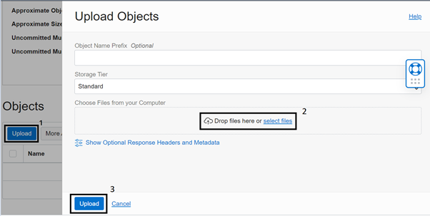

Podemos arrastar todas as imagens que vamos fazer o upload de uma única vez. Para facilidade dos passos seguintes, é recomendado que sejam feitos os uploads das imagens, e não da pasta contendo as imagens (ao invés de upar uma única pasta com 200 imagens, recomenda-se upar as 200 imagens). Não há necessidade de separarmos em pastas diferentes para cada raça (já tomamos este cuidado na nomeação das imagens antes de disponibilizar o dataset). 
Esta forma de fazer o upload arrastando imagens ao console é bastante simples e rápida, mas não é indicada para números muito grandes de imagems (como acima de 500), pois pode demorar significativamente ou para quantidades muito grandes (como acima de 1000 imagens) pode resultar em erro. É possível entretanto, no melhor estilo gambiarra, dividir uma quantidade imensa de imagens em “bateladas” menores, e fazer o upload dessas bateladas menores até que se termine o dataset. Mas para casos muito extensos, é mais interessante (e elegante) utilizar o outro método.


  *   **Via linha de comando (CLI):** Este é a forma de se fazer upload de grandes quantidades de arquivos (ou de arquivos muito pesados). Como é um passo um tanto quanto longo, e exige diversas etapas de configurações, disponibilizaremos materiais para quem se interessar e quiser seguir por este caminho. Apesar de mais consideravelmente mais demorado e trabalhoso do que o método acima, toda a etapa de configuração só precisa ser feita uma única vez, e permite o uso de todas as ferramentas do OCI através da sua própria máquina via linhas de comando. Vale a pena, é trabalho de uma vez só e te permite muita flexibilidade!  Basta acessar os links: [Configuring the SDK](https://docs.oracle.com/en-us/iaas/tools/python/2.72.0/installation.html#install) e  [SDK for Python](https://docs.oracle.com/en-us/iaas/Content/API/SDKDocs/pythonsdk.htm)

5.	Agora, vamos preparar nosso dataset no DataLabeling. Para isto, acessa-se o Data Labeling novamente clicando no menu de hamburguer, então na aba “Analytics & AI”, e logo abaixo a opção “Machine Learning” encontramos o Data Labeling:

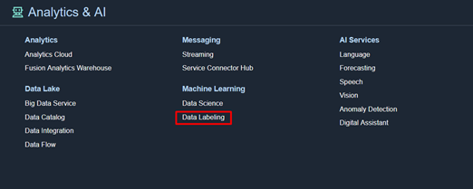

No Data Labeling, vamos criar um novo dataset que irá servir de base de treino para o modelo customizado. Então, no canto esquerdo, clicamos em “Datasets”. 

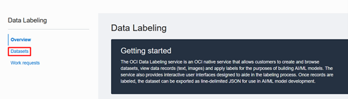

Após verificar se estamos no compartimento correto, vamos então criar um novo dataset de fato, e para isso clicamos na opção “Create dataset”.

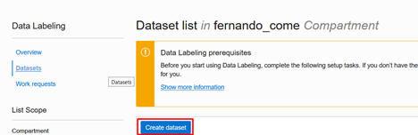

6.	Ajustar as informações do dataset. Inicialmente, damos um nome e uma descrição (opcional) ao dataset.
Em seguida, importante! Selecionar o formato de dado que seu dataset conterá (imagens, textos ou documentos). Como no nosso caso trabalharemos com um classificador de imagens, selecionamos a opção de “images”:


Por útlimo, selecionar o tipo de rótulo de nossas imagens, se elas são do tipo **“single label”**, **“multi-label”** ou ainda **“object detection”**. Como nosso modelo é de uma classificação onde cada imagem só pode estar em uma única categoria, cada imagem só pode ter um rótulo (a raça do gato), e portanto vamos selecionar a opção **“single label”**:

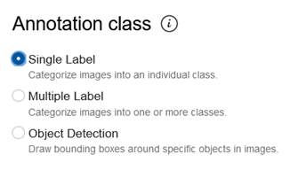

Feito isso, clicamos no botão “next” e partimos para a próxima etapa.

7.	Escolher os dados corretos que vamos utilizar. Para isso, na próxima tela, selecionamos que vamos utilizar arquivos do Object Storage, visto que já fizemos o upload das imagens no bucket:

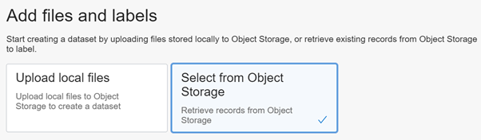

Então, definimos de onde esses dados virão; ou seja, o bucket onde fizemos o upload nos passos iniciais (por isso, importante lembrar o nome do bucket!):

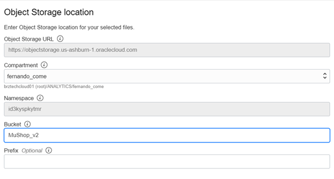

Por último, mas não menos importante, vamos definir os rótulos que este dataset terá. Como nós estamos tratando de uma classificação onde cada imagem terá apenas uma única categoria, temos apenas dois rótulos: **Exótico** e **Sphynx**. Para inserir um rótulo, basta digitar seu nome e apertar “Enter”, e em seguida digitar os outros que possam existir.


Após este passo, basta clicar em “Next” novamente, rever as informações e finalmente clicar em “Create”, no mesmo local onde ficavam os botões de “Next” nos passos anteriores. 
O processo de criação do dataset costuma levar alguns minutos, com seu progresso podendo ser acompanhado pela informação “Generating Records”, no campo superior direito da tela.
O dataset pronto deve estar com essa “cara”: (preste atenção no OCID dele, pois será importante!)
 
 
 
 8.	Feita a criação do Dataset, vamos partir para o rotulamento, pois podemos ver na imagem acima que temos 0/527 images rotuladas. Este processo pode ser feito de duas formas: manual ou via script. Caso oprte por fazer manualmente, é interessante convidar a família toda e ter uma atividade lúdica e (nem tão) divertida. Por motivos óbvios, vamos utilizar a opção via script, que fará todo esse processo de forma automática. Para isso, utilizaremos o CloudShell e um script.py já construído, que pode ser encontrado no seguinte link: [oci-dls-bulk-labeling](https://github.com/scacela/oci-dls-bulk-labeling). O uso do CloudShell torna possível pular as etapas de download e configuração do Python SDK do OCI, bem como a Interface de Linha de Comando, tornando o processo mais simples.

9.	Acessar o CloudShell do OCI clicando no ícone no canto superior direito (pode demorar alguns minutos para ser instanciado no primeiro acesso):


No Cloud Shell, executar a seguinte linha de comando: **`git clone https://github.com/scacela/oci-dls-bulk-labeling`**

Recomendo dar uma olha breve olhadinha no material, em especial o arquivo config.py, pois será necessário fazer algumas alterações neste arquivo para que o script funcione corretamente para o nosso dataset.  

10.	Feita a cloagem do repositório, execute ainda no CloudShell o comando “ls” (LS minúsculos) para que sejam listados todos os documentos presentes. Seu Shell deve estar semelhante a:

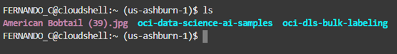

(Ignore os arquivos American Bobtail (39).jpg e oci-data-science-ai-samples da foto; eles não estarão presentes no seu shell). 

11.	Precisamos agora justamente editar o arquivo config.py contido neste repositório. Para isso, executamos o comando: **`cd oci-dls-bulk-labeling`**

Executando novamente o comando “ls”, vemos que todos os arquivos de fato foram clonados do repositório: 

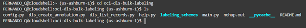

12.	Vamos então abrir o arquivo config.py para editá-lo. Para isso, executamos o comando: **`vi config.py`**
Em seguida, alterar os pontos necessários. Analisando o código original, temos: 

```
# for help, run:
# python3 help.py

# config file path
config_file_path="~/.oci/config"
# config file profile
config_profile="DEFAULT"
# region identifier of DLS Dataset
region_identifier="us-ashburn-1"
# compartment where DLS Dataset exists
compartment_id = "<Compartment OCID>"
# ocid of the DLS Dataset
dataset_id = "<DLS Dataset OCID>"
# an array where the elements are all of the labels that you will use to annotate records in your DLS Dataset with. Each element is a separate label.
labels = ["<label 1>", "<label 2>", "<label 3>"]
# the algorithm that will be used to assign labels to DLS Dataset records
labeling_algorithm = "first_match"
# use for first_match labeling algorithm
first_match_regex_pattern = r'^([^/]*)/.*$'
# maximum number of DLS Dataset records that can be retrieved from the list_records API operation for labeling
# limit=1000 is the hard limit for list_records
list_records_limit = 1000
``` 

Os pontos em negrito são os que devem ser alterados:
*	Compartment OCID
*	DLS Dataset OCID
*	Labels
*	Labeling Algorithm
*	Region (caso a sua região não seja Ashburn)

Vamos alterar as seguintes linhas: 
* **`region_identifier="us-ashburn-1"`** (caso sua região não seja Ashburn)
* **`compartment_id = "<Compartment OCID>"`**
* **`dataset_id = "<DLS Dataset OCID>"`**
* **`labels = ["<label 1>", "<label 2>", "<label 3>"]`**
* **`Labeling Algorithm = first_match`**

Estas informações podem ser encontradas analisando o compartimento em questão: 

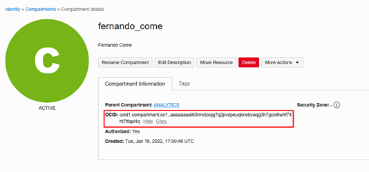

Para acessar, basta digitar “Compartments” na aba de busca para encontrar os compartimentos e extrair a informação relevante. 
Para o Dataset, acessamos novamente o Data Labeling, clicamos em “Datasets” e em seguida selecionamos aquele que acabou de ser criado. Seu OCID aparece desta forma: 

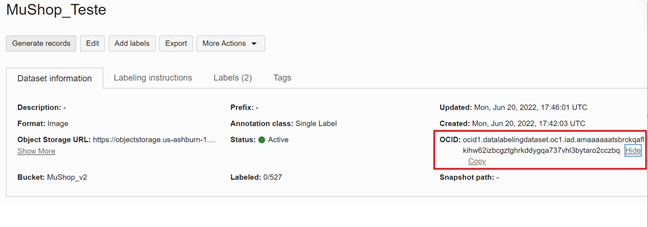

(Atenção para a informação de dados rotulados: Labeled: 0/527. Mostrando que nenhuma das 527 imagens ainda possuí rótulo atribuído. 

Na linha de código contendo os rótulos (labels), vamos preencher com os rótulos envolvidos no nosso caso, que são Covid e Normal. Sendo assim, nossa linha de código seria: 

**`labels = [“Exotic", "Sphynx"]`**

Na linha de **`“Labeling Algorithm”`**, vamos alterar para **`“First Letter”`** 
Após todas essas alterações, nosso arquivo config.py deve estar semelhante a: 

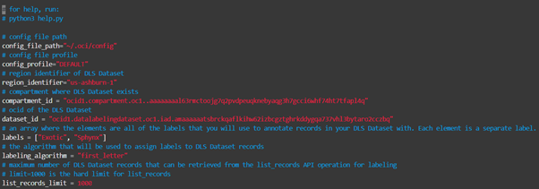

(Para editar com o vi, apertamos a tecla “i” para entrarmos no modo “insert”, e então podemos mexer no código. Após as alterações, apertamos “esc” para sair do modo “insert”, e então executamos “:wq” para salvar as alterações e sairmos do editor vi.)

13.	O último passo então é rodar o script! Para isso, basta executar o comando: 

**`python3 main.py`**

O script então começará a fazer o rotulamento automático dessas imagens, tomando como base o nome do arquivo e o nome do rótulo. A associação feita por este método é a mais simples possível, relacionando a primeira letra do nome do rótulo com a primeira letra do nome do arquivo.  

Apenas para curiosidade, a versão do script que estamos usando nesta demo é uma versão “simplificada”, desenvolvida para que seja necessário efetuar o mínimo de alterações nos código. Temos uma versão maior, mais robusta, que contempla paralelização do processo (utilizando todos os núcleos do processador disponível), que também suporta o método de rótulos customizados, tanto em Java quanto em Python. Este script está disponível no seguinte repositório: 
[bulk_labeling_script](https://github.com/oracle-samples/oci-data-science-ai-samples/tree/master/data_labeling_examples)

Não é necessário utilizá-lo neste laboratório, mas caso tenha interesse, é uma opção muito interessante, mais rápida, versátil e poderosa do que o script simplificado que estamos utilizando aqui. 
Após concluído o processo, seu dataset deve constar da seguinte forma:

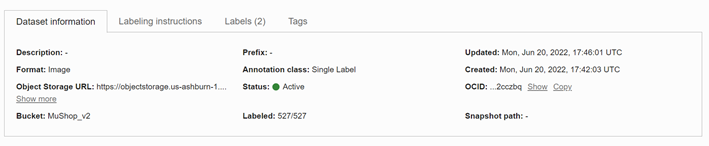

Notar que agora consta “Labeled: 527/527” rotuladas. A etapa de preparação do Dataset está finalmente concluída. Agora podemos partir para a criação do modelo propriamente dita. 

14.	Criação do Modelo: Vamos então abrir o OCI Vision. Para isto, clicamos novamente no menu de hamburger e selecionamos: Analytics & AI -> AI Services -> Vision


15.	Na tela do Vision, vamos clicar em “Projets” abaixo de “Custom Models” para criar um novo modelo customizado para nossa aplicação (canto esquerdo): 

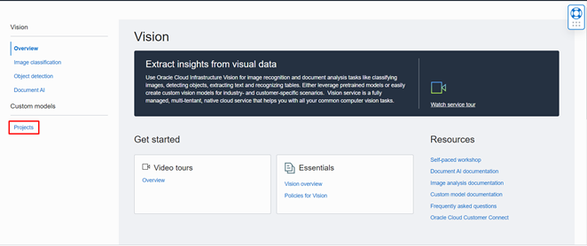

16.	Criar o novo projeto. Para isso, basta clicar em “Create project” (e certificar de que os pré-requisitos de policies estão satisfeitos).

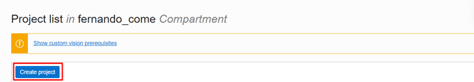

17.	Definir então o nome do projeto, e adicionar uma descrição opcional:

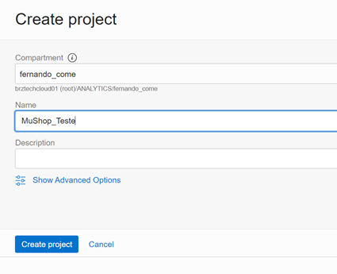

18.	Clicamos então neste novo projeto, o que nos leva à tela do projeto. Agora, vamos finalmente criar o modelo propriamente dito. 

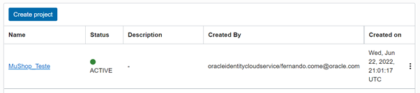

19.	Vamos então criar o modelo. Para isso, clicamos no nosso projeto recém-criado e então criamos o nosso modelo. Basta clicar no botão “create model” na página abaixo:

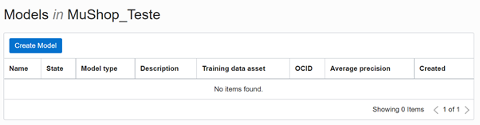

20.	Vamos definir agora as especifidades do nosso modelo. Em especial, o tipo de tarefa que ele terá de fazer e se utilizaremos um dataset já existente ou criaremos um novo. Como nosso modelo deve classificar um gato com a sua raça, temos um problema de Classificação de Imagem (e não de Detecção de Objetos). Além disso, como passamos todos os passos iniciais preparando e criando o Dataset, vamos selecionar a opção de um Dataset já existente.

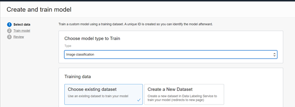

21.	Então vamos definir que pegaremos nosso dataset do Data Labeling, e mais precisamente, qual será esse dataset! (lembre-se com carinho dos nomes que você deu pra eles!)

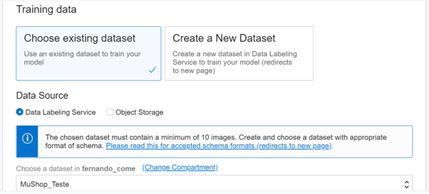

Feito isso, basta clicar na opção “Next” e partir para o treinamento do modelo.

22.	Na página seguinte, além do nome do modelo vamos escolher outro parâmetro muito importante: seu tempo de treino. Basta definir entre 3 opções:
* 	Recomendado (o próprio Vision define o tempo ideal baseado na complexidade e tamanho do dataset e da tarefa a ser realizada)
* 	Rápido (também definido pelo próprio Vision, mas consideravelmente mais rápido, e consequentemente menos preciso)
* 	Customizado (definido pelo usuário)
A precisão do modelo, obviamente, é fortemente dependente do seu tempo de treino, portanto, em geral, a opção Recomendada é a recomendada (rsrs). Novamente, escolha um nome bastante descritivo que você vá lembrar futuramente.

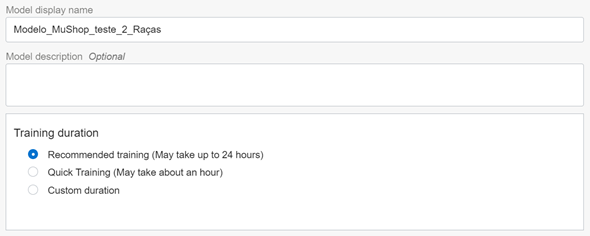

Escolhidos estes parâmetros, basta clicar em “Next”, revisar as informações e, finalmente, clicar em “Create and Train”:

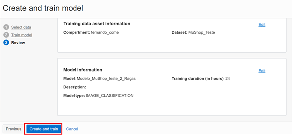

Agora é só esperar a mágica acontecer! O Vision irá extrair o Dataset do Data Labeling, provisionar uma instância para efetuar estre treinamento e efetuar todo o deploy e disponibilização do modelo automaticamente. (Não se deixe enganar pelo “Training Duration” de 24 horas; esse é o máximo possível tolerado pela ferramenta; será muito mais rápido do que isso).

Durante o processo de treino, temos a seguinte tela:

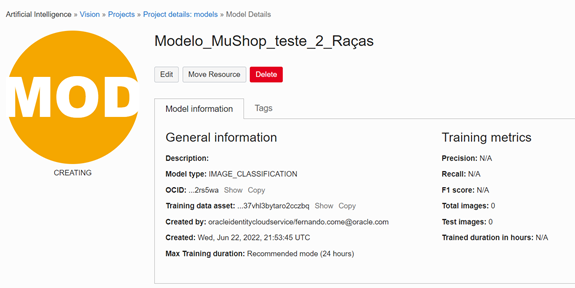

Ao fim do processo, esta tela estará:


Importante notar as métricas de treino do modelo, de Precisão, Recall e Score F1; métricas muito importantes para avaliar a performance do modelo.

23.	Terminado o treino e deploy do modelo, basta agora utilizá-lo. Para isto, basta, descer esta mesma tela até a interface com o modelo. Vamos utilizar exemplos locais, arrastando imagens de gatos locais até a área dedicada.

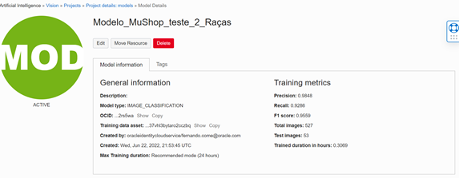


Após arrastada a imagem, podemos ver os retornos do modelo, sendo composto pela confiança em cada uma das classes:

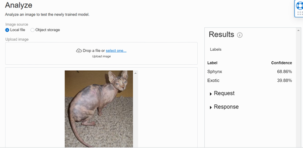
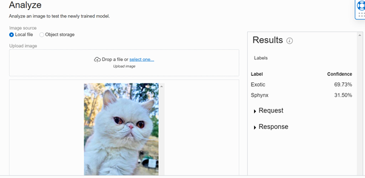


